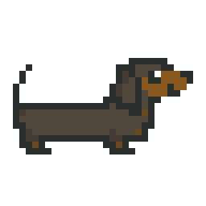

# Snake game with Dachshund ("sausage dog") in JavaScript :dog:

## Starting point

I wanted to make a small game based on the Snake from Nokia 3310.
This tutorial using canvas with colored squares in JavaScript was my starting point : https://github.com/CodeExplainedRepo/Snake-JavaScript

My goal is not to copy/paste the code of this tutorial : I want to replace the snake with a dachshund (sausage dog).
My first problem was to separate the head, the body (belly), and the tail, because I wanted that only the belly of the dog could grow.  

 
## To do

First, with colored squares to display the "dog-snake" :
- [x] Find a way to separate head, body and tail of the "dog-snake" for the display

Create the sprites using Krita
- [x] Small "dog-snake", horizontal and vertical
- [x] Head, vertical and horizontal
- [x] Body
- [x] Tail, vertical and horizontal
- [x] One big sprite with all the elements : then only one image to load
- [x] Food 
- [ ] Create a sprite with round angles so the dog is not split when it turns

- [ ] Update the sprite sheet

Track the axis and the direction  of the "dog-snake" to display the correct sprite :
- [x] Horizontal or vertical axis for small "dog-snake"
- [x] Direction for small "dog-snake"
- [x] Horizontal or vertical axis for "dog-snake"'s head, body, tail
- [x] Direction for"dog-snake"'s head, body, tail

Last but not least :
- [ ] Clean the code
